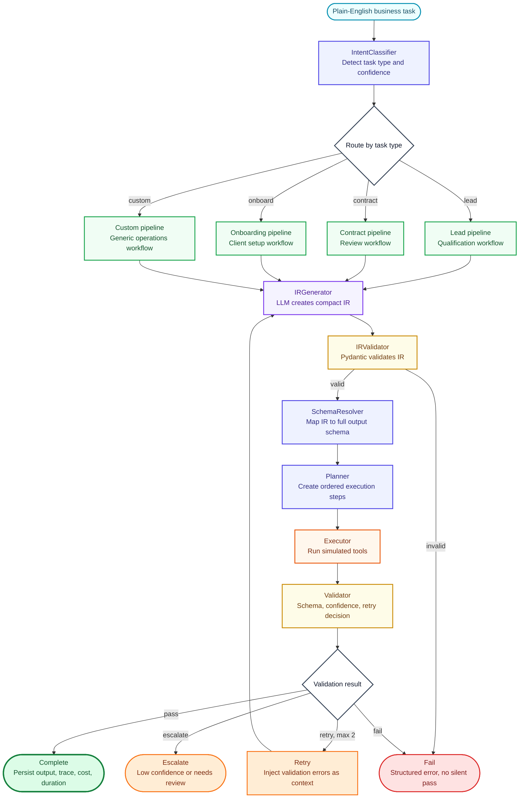

# AI Business Automation Platform

A full-stack, production-ready multi-agent AI operations platform. Businesses submit any operational task in plain English — the platform classifies it, plans execution, runs each step with the appropriate tool, validates output against a strict schema, and streams the entire process live to a professional dashboard UI. This is not a chatbot; it is a deterministic AI operations layer with full execution transparency.

---

## Architecture

```
┌─────────────────────────────────────────────┐
│                   Frontend                  │
│         React + Vite + Tailwind             │
│   REST (Axios)       WebSocket (live view)  │
└────────────────────┬────────────────────────┘
                     │
┌────────────────────▼────────────────────────┐
│              API Gateway                    │
│     FastAPI · JWT middleware · File upload  │
└────────────────────┬────────────────────────┘
                     │
┌────────────────────▼────────────────────────┐
│           Agent Orchestration               │
│  LangGraph master graph                     │
│  IntentClassifier → task sub-graph router   │
│  IRGenerator → IRValidator → SchemaResolver │
│  Planner → Executor → Validator             │
└──────────┬──────────────────────┬───────────┘
           │                      │
┌──────────▼──────┐    ┌──────────▼───────────┐
│   State Layer   │    │      LLM Layer        │
│ Redis (live)    │    │ Ollama (dev, CPU)      │
│ SQLite/Postgres │    │ OpenAI GPT-4o (prod)  │
│   (history)     │    │ — swap via USE_OPENAI │
└─────────────────┘    └──────────────────────┘
```

---

## Agent Graph

See [`docs/workflow_graph.md`](docs/workflow_graph.md) for final Mermaid workflow diagrams and instructions for exporting the actual compiled LangGraph graph.



---

## Tech Stack

| Layer | Technology |
|---|---|
| Frontend | React 18, Vite 5, Tailwind CSS 3, shadcn/ui, React Router 6 |
| State & Data | TanStack Query 5, Zustand 4, React Hook Form 7, Zod 3 |
| Charts | Recharts 2 |
| Backend | FastAPI, LangGraph, Pydantic v2, Celery |
| Database | SQLAlchemy 2 + Alembic · SQLite (dev) → Postgres (prod) |
| Cache / State | Redis |
| Auth | JWT (python-jose) + bcrypt |
| LLM (dev) | Ollama — `mistral:latest` or `gemma3:270m`, CPU-only |
| LLM (prod) | OpenAI GPT-4o — single `USE_OPENAI=true` flag |
| Deployment | Vercel (frontend) · Railway (backend + Celery) · Redis Cloud · Supabase |
| CI | GitHub Actions — lint + test on every push |

---

## Requirements

- Python 3.11+
- Node.js 20+
- Redis (local or Docker)
- Ollama with `mistral:latest` pulled (`ollama pull mistral`)
- Docker + Docker Compose (for full local stack)

Production deployment notes live in [`docs/deployment.md`](docs/deployment.md).

---

## Setup

### Option A — Docker Compose (recommended)

```bash
git clone https://github.com/your-username/ai-automation-platform
cd ai-automation-platform
cp backend/.env.example backend/.env
docker compose up --build
```

Frontend: http://localhost:5173  
Backend API: http://localhost:8000  
API Docs: http://localhost:8000/docs

### Option B — Manual

```bash
# Backend
cd backend
cp .env.example .env
pip install -e ".[dev]"
alembic upgrade head
uvicorn app.main:app --reload

# In a second terminal (Celery worker)
cd backend
celery -A app.celery_app worker --loglevel=info

# Frontend
cd frontend
npm install
npm run dev
```

### Switch to OpenAI for live demo

```bash
# In backend/.env
USE_OPENAI=true
OPENAI_API_KEY=sk-...
# Restart backend — zero code changes required
```

Production env templates:

- `backend/.env.production.example`
- `frontend/.env.production.example`

---

## Key Design Decisions

- **IR (Intermediate Representation) pattern** — the LLM never sees the full output schema. It outputs a compact IR only; the backend `SchemaResolver` maps it to the full Pydantic model. This prevents hallucinated fields and makes schema changes non-breaking for the LLM.
- **Single `USE_OPENAI` flag** — the entire codebase routes through one unified `llm_client.py`. Switching from Ollama to OpenAI GPT-4o requires no code changes, only an env variable.
- **Hard-fail over silent pass** — if output fails schema validation after 2 retries, the task fails with a structured error reason. Partial or unvalidated outputs are never returned to the user.
- **Celery for execution isolation** — agent pipelines run in background workers so the HTTP response returns immediately with a `task_id`. The frontend subscribes via WebSocket for live progress.
- **Versioned schemas** — each task type output schema carries a version. Old execution traces remain replayable even after schema changes.
