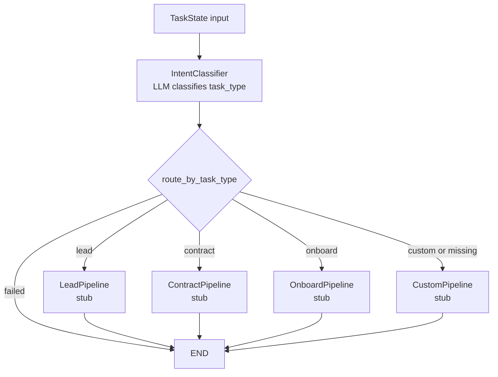

# Step 6 LangGraph Visualization

This is the current graph after Step 6. Only `IntentClassifier` is a real node so far. The four pipeline nodes are temporary stubs that let the graph compile while later steps fill in the actual IR, planning, execution, and validation flow.

## What To Notice

- `TaskState` is the object passed through the graph.
- `IntentClassifier` sets `state.task_type`.
- `route_by_task_type()` reads `state.task_type` and chooses the next branch.
- If classification fails, `state.status` becomes `failed` and the graph ends.
- Later steps will replace the stubs with real nodes.

