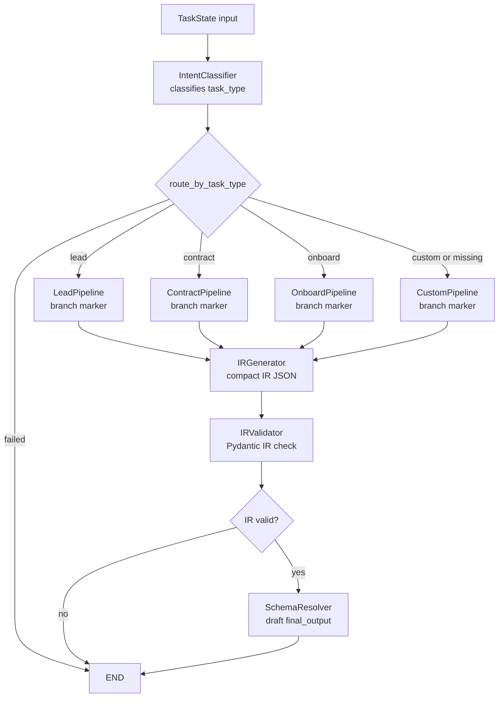

# Step 7 LangGraph Visualization

This is the graph after adding the IR pattern. `IntentClassifier` still chooses the broad business task type, then the selected branch flows into shared IR nodes.

## Why The IR Layer Exists

The IR layer keeps the first LLM output small. Instead of asking the model to produce a large final object immediately, the platform asks for a compact representation first, validates it, and only then expands it into the fuller business output shape.

This matters because small contracts are easier for an LLM to follow and easier for us to reject safely when malformed.

