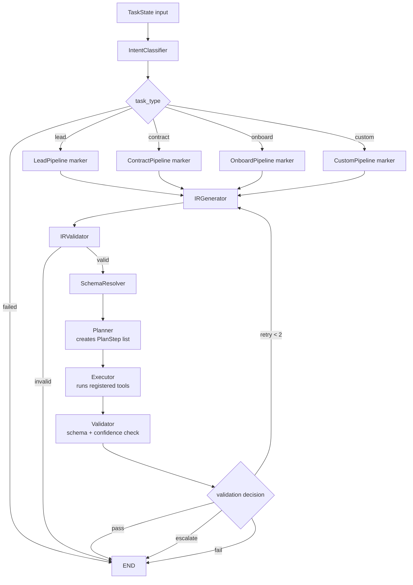

# Step 8 LangGraph Visualization

Step 8 adds the execution heart of the platform: planning, execution, validation, retry, escalation, and failure routing.

## What Changed

- `Planner` creates an ordered list of up to 8 `PlanStep` records.
- `Executor` runs each step against `TOOL_REGISTRY` when Step 9 tools exist.
- `Validator` checks `final_output` against the full task schema.
- Validation failures retry from `IRGenerator` up to 2 times.
- Low-confidence valid outputs become `escalated`.
- Valid, confident outputs become `success`.

## Why Step 9 Still Matters

The executor is wired now, but the simulated tool functions are not created until Step 9. Until then, planned tools will be reported as unregistered. That is expected at this stage.

