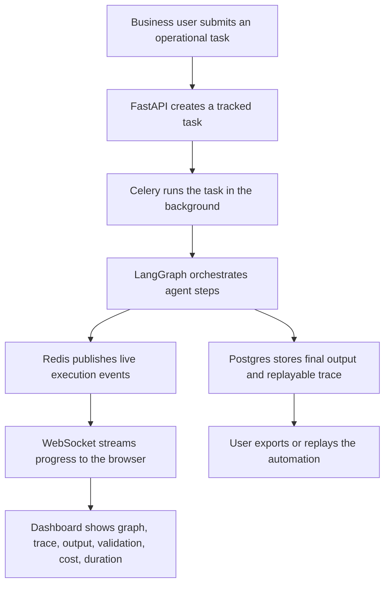
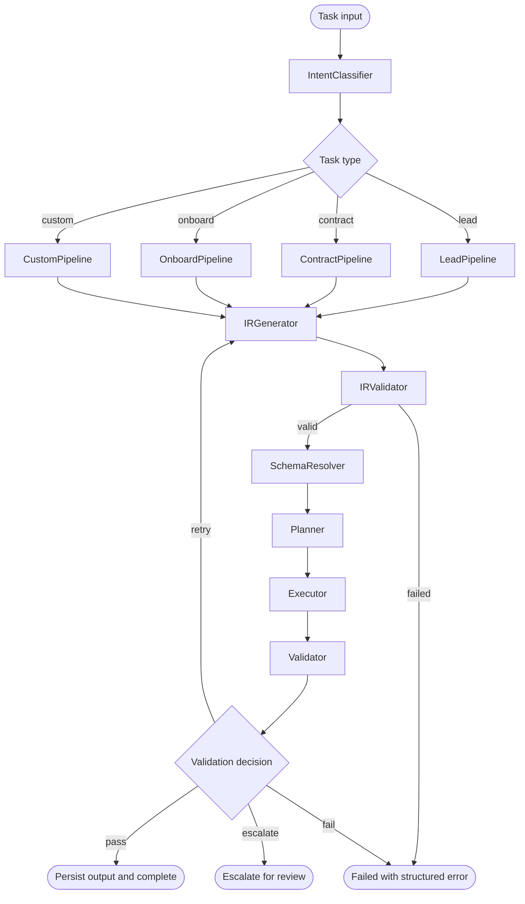

# Workflow Graph

This document replaces the old intermediate `langgraph_step*` notes with final workflow diagrams.

## Client-Facing Workflow

Use this graph when explaining the project to a client or portfolio reviewer. It focuses on business value: traceable automation, not chat.



## Agent Execution Workflow

Use this graph when explaining the backend agent pipeline.



## Generated LangGraph Workflow

The diagrams above are curated for humans. To export the actual compiled LangGraph structure from code, run:

```bash
cd backend
python scripts/export_graph.py
```

To write it to a Mermaid file:

```bash
cd backend
python scripts/export_graph.py --output ../docs/generated_langgraph.mmd
```

The export script uses:

```python
compiled_graph.get_graph().draw_mermaid()
```
